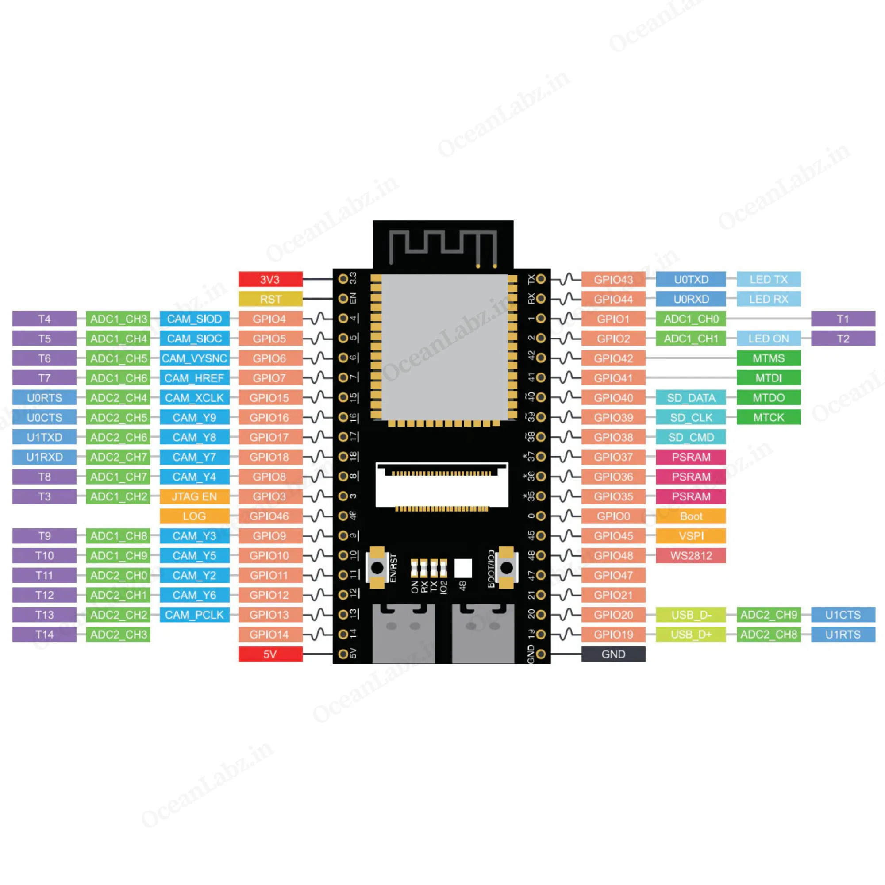

## 📄 **README.md**
# 🤖 YOLO Robot - ESP32-S3 Firmware & Control Panel

Robot seguidor de objetos con visión artificial en tiempo real. Usa una **ESP32-S3** (como Master SPI) con cámara OV2640 para transmitir video por Wi-Fi a un navegador web, donde **YOLOv11n** (ejecutado con ONNX Runtime) detecta personas y envía comandos de navegación por WebSocket. El ESP32 SPI Slave ejecuta un control PID a 50 Hz sobre dos motores con driver L298N, asistido por sensores VL53L0X ToF para frenado de emergencia.

Este repositorio contiene el firmware de control y la interfaz web para un robot autónomo. El proyecto combina control de lazo cerrado en tiempo real, procesamiento de sensores, streaming de video y una arquitectura web optimizada para entornos embebidos.

---

## 🚀 Características Principales

* **Control PID de Lazo Cerrado (50Hz):** Implementación de un controlador de velocidad (`SpeedController`) con anti-windup inteligente, alimentación hacia adelante (*Feedforward* al 85%) y captura atómica de pulsos de encoders (`std::atomic`) para evitar condiciones de carrera.
* **Arquitectura Multitarea (FreeRTOS):** Distribución de carga de trabajo asignando tareas críticas a núcleos específicos (`xTaskCreatePinnedToCore`). El Core 1 se encarga del lazo de control de los motores, mientras que el Core 0 gestiona la red y los periféricos de alta demanda.
* **Servidor HTTP Unificado & Streaming:** Servidor web nativo que expone un stream de video en tiempo real (MJPEG desde cámara OV2640) en el puerto `80`, compartiendo el canal de forma segura con los archivos de la interfaz.
* **Frontend Monolítico Ultra-liviano:** Interfaz de usuario diseñada con **Tailwind CSS**. Todo el HTML, CSS y JavaScript están unificados en un único archivo comprimido en la memoria flash (`index.html.gz`), reduciendo el uso de SPIFFS a menos de **15 KB** y minimizando las peticiones HTTP a una sola transacción.
* **Telemetría por WebSockets:** Conexión full-duplex bidireccional en el puerto `81` para el envío de comandos de movimiento (paquetes binarios optimizados) y recepción de lecturas de sensores en tiempo real.

---

## 🛠️ Arquitectura de Software (Distribución de Núcleos)

El firmware saca provecho del procesador de doble núcleo del ESP32-S3 mediante FreeRTOS:

* **Master Core 0 (Comunicaciones y Video):**
    * Servidor HTTP (`WebServer.h`) + Ruta de video `/stream`.
    * Lazo de eventos de `WebSocketsServer`.
    * Gestión de la pila Wi-Fi.
* **Master Core 1 (Comunicación SPI con Slave):**

* **Slave Core 0 (Comunicación SPI con el Master):**
    * `tofSensorTask`: Lectura de sensores de distancia ToF (VL53L0X) y lógica de 
* **Slave Core 1 (Control y Sensores):**
    * `tofSensorTask`: Lectura de sensores de distancia ToF (VL53L0X) y lógica de evasión.
    * `motorTask`: Ejecución del PID de velocidad cada 20ms e inyección de PWM al puente H.

---

## 📂 Estructura del Proyecto Base

```text
src/
├── main.cpp     # Punto de entrada, WiFi, WebSocket, FreeRTOS                  
|                # Inicialización OV2640
|                # Comunicación WebSocket
├── motor_control.cpp/h   # Cinemática diferencial y L298N
├── speed_controller.cpp/h # PID a 50 Hz
├── sensor_control.cpp/h         # VL53L0X + HC-SR04                  
├── data/
│   └── index.html       # Frontend monolítico (HTML+CSS+JS)                # Drivers de sensores y cámara
├── platformio.ini          # Configuración del entorno de desarrollo y dependencias
└── README.md


## 📐 Arquitectura

```
Cámara OV2640 ──► ESP32-S3 (Stream MJPEG + WebSocket)
                        │
                        Wi-Fi
                        │
Navegador (HTML5 + ONNX Runtime Web) ──► YOLOv11n ──► Comandos (WebSocket binario)
                        │
                        ▼
              ESP32-S3 (motorTask 50 Hz + PID)
                        │
              Driver L298N ──► Motores DC
```

---

## ✨ Características

- **Detección en tiempo real**: YOLOv11n corre en el navegador con WebGL/WASM.
- **Stream MJPEG**: La cámara OV2640 transmite a 320×240.
- **Control PID**: Bucle de control a 50 Hz en núcleo dedicado del ESP32.
- **Modo manual**: Joystick táctil con botones direccionales.
- **Failsafe**: Frenado automático si se pierde la señal (500 ms).
- **Telemetría**: Batería y distancias de sensores en HUD.
- **Cinemática diferencial**: Control preciso de dirección (0‑360°) y velocidad.

---

## 🛠️ Hardware

| Componente | Descripción |
|------------|-------------|
| **Placa** | ESP32-S3 DevKit-N16R8 CAM |
| **Cámara** | OV2640 integrada |
| **Driver** | L298N (2 canales) |
| **Sensores** | 3× VL53L0X ToF (frontal, izquierdo, derecho) |
| **Sonar** | HC-SR04 (RMT) |
| **Alimentación** | Batería 7.4 V LiPo (2S) |

### Pinout

| Cámara OV2640 
| Ver `src/main.cpp` y https://www.oceanlabz.in/getting-started-with-esp32-s3-wroom-n16r8-cam-dev-board/
| VL53L0X (I2C) | SDA=4, SCL=5 |
| HC-SR04 | TRIG=?, ECHO=? | No conectado en esta trarjeta


## 📂 Estructura del Proyecto Software 

### ESP32 (PlatformIO)

esp32_s3_YOLO/
├── src/
│   ├── main.cpp        # Punto de entrada, WiFi, WebSocket, tareas FreeRTOS
│   ├── camera_pins.h   # Coneccion OV2640 -Esp32
│   ├── motor_control.cpp/h # Manejo de L298N
│   ├── speed_controller.cpp/h # Cinemática diferencial, PID a 50 Hz
|   ├── sonar_integration.cpp/h # HC-SR04
|   └── sensor_control.cpp/h # Manejo VL53L0X
├── data/
│   └── index.html
├── platformio.ini
├── partitions_spiffs_big.csv
└── README.md
``````
---
## 🛠️ Arquitectura de Software (Distribución de Núcleos)

El firmware saca provecho del procesador de doble núcleo del ESP32-S3 mediante FreeRTOS:

* **Core 0 (Comunicaciones y Video):**
    * `httpTask`: Servidor HTTP (`WebServer.h`) + Ruta de video `/stream`.
    * Lazo de eventos de `WebSocketsServer`.
    * Gestión de la pila Wi-Fi.
* **Core 1 (Control y Sensores):**
    * `tofSensorTask`: Lectura de sensores de distancia ToF (VL53L0X).
    * `motorTask`: Ejecución del PID de velocidad cada 20ms e inyección de PWM al puente H.

---
### Frontend (HTML5 + ONNX Runtime Web)

- `data/index.html`: Interfaz completa con modo manual y autónomo.
- Modelo YOLOv11n servido desde GitHub Pages.

---

## 🚀 Instalación

### 1. Clonar el repositorio

### 2. Configurar Wi-Fi

Edita `src/main.cpp`:

```cpp
const char* ssid = "TU_WIFI";
const char* password = "TU_CONTRASEÑA";
```

### 3. Subir el firmware

```bash
pio run --target upload
```

### 4. Subir el frontend a SPIFFS

```bash
pio run --target uploadfs
```

### 5. Subir el modelo ONNX a GitHub Pages

1. Crea un repositorio público `robot-models`.
2. Sube `yolo11n.onnx` a la raíz.
3. Activa GitHub Pages en Settings → Pages.
4. La URL será: `https://TU_USUARIO.github.io/robot-models/yolo11n.onnx`

### 6. Acceder al robot

Abre en el navegador: `http://<IP_ESP32>/`

---

## 🎮 Uso

### Modo Manual
- Usa los botones direccionales para mover el robot.
- **↑** Avanzar | **↓** Retroceder | **← →** Girar.
- **PARAR**: Detiene los motores.

### Modo YOLO Autónomo
1. Selecciona **"YOLO Autónomo"**.
2. Apunta la cámara hacia una persona.
3. El robot la seguirá automáticamente:
   - Mantiene distancia de seguridad.
   - Gira para centrar a la persona.
   - Frena si la persona está demasiado cerca.

### Telemetría
- El HUD muestra batería y distancias de los sensores ToF.
- El indicador WS muestra el estado de la conexión WebSocket.

---

## ⚙️ Ajustes

### Umbrales de YOLO

En `index.html`:

```javascript
const CONF_THRESHOLD = 0.45;   // Confianza mínima
const CLASS_TARGET = 0;        // 0=persona (COCO)
const AREA_FRENO = 0.6;        // % de pantalla para frenar
```

### PID

En `speed_controller.cpp`:

```cpp
float Kp = 1.5f;    // Ganancia proporcional
float Ki = 0.3f;    // Ganancia integral
```

---

## 📁 Estructura del proyecto

---

## 🔗 Dependencias

### PlatformIO

```ini
lib_deps =
    esp32-camera
    WebSockets
    VL53L0X
```

### Frontend (CDN)

- [ONNX Runtime Web](https://cdn.jsdelivr.net/npm/onnxruntime-web/dist/ort.min.js)

---

## 📝 Licencia


---

## 🙏 Agradecimientos

- [Ultralytics](https://github.com/ultralytics/ultralytics) por YOLOv11.
- [Espressif](https://github.com/espressif/esp32-camera) por la librería de cámara.
- [ONNX Runtime](https://onnxruntime.ai/) por la inferencia en navegador.
```
---


